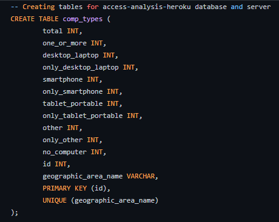

# access-analysis

1. Database stores static data for use during the project
  - Used pgAdmin to create four tables to use in the machine learning: comp_types, income_internet, inc_int_comp, inc_int_no_int
2. Database interfaces with the project in some format
  - Connected Heroku to pgAdmin, to make local database available in the cloud

  
3. Includes at least two tables
  - Used pgAdmin and SQL to create tables with the cleaned raw data

  
  - Started with two tables: comp_types and income_internet

  

  
4. Includes at least one join using the database language
  - Used SQL to join tables

  
  - Created inc_int_comp

  
5. Includes at least one connection string
  - Used SQLAlchemy in Jupyter Notebook to connect Heroku to Jupyter Notebook

  
