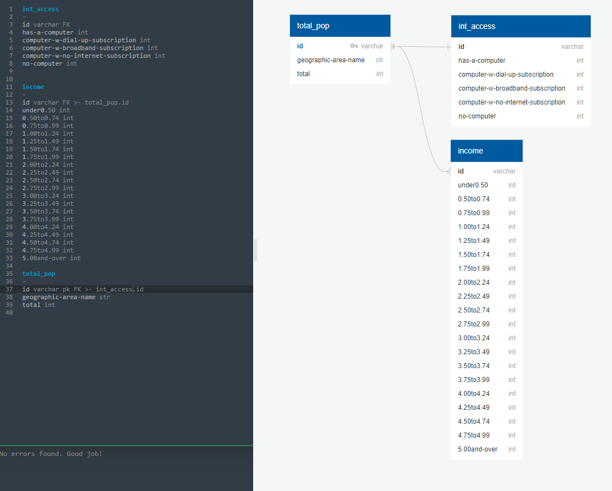

# ERD Mockup

- We have three tables
  - total_pop
    - Presence of a Computer and Type of Internet Subscription in Household
  - int_access
    - Presence of a Computer and Type of Internet Subscription in Household
  - income
    - Ratio of Income to Poverty Level of Families in the Past 12 Months

The following is an ERD mockup of what this would look like after cleaning the data (dropping unnecessary columns and converting columns to appropriate datatypes):

Tables will then be merged on the unique `id` column.

Additional cleaning and preprocessing may be needed to prep data for machine learning models.
